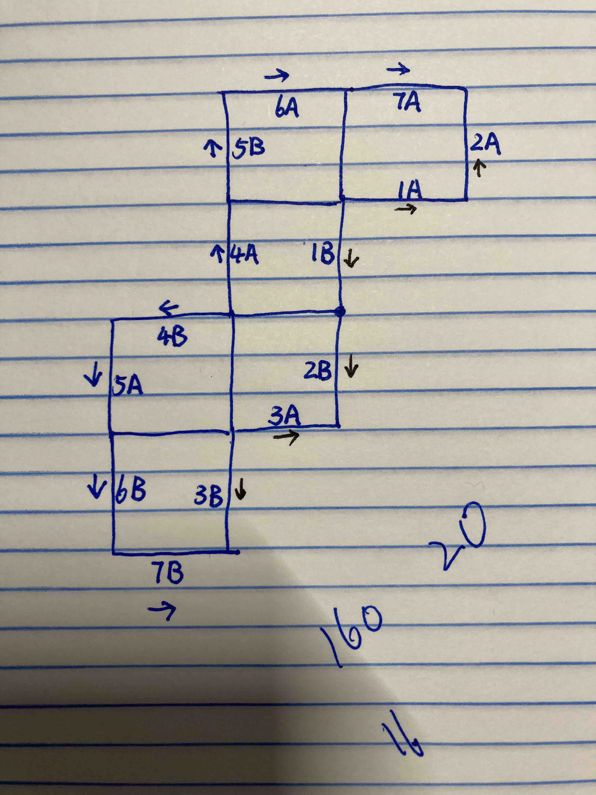

# Notes and journals
## Day 22 (Dec 21, 2022)
Some helpful visualization:



## Day 15 (Dec 14, 2022)
I don't know why but I implemented the same idea as some of the solutions posted on [Reddit]() but my solution is very slow... Today's problem took one Reddit user's solution 15ms to solve, but my solution, using largely the same idea, took 70 seconds!

## Day 13 (Dec 12, 2022)
Today's problem was the first that I could not solve within 2 hours. The main difficulty lies with parsing the inputs. I could either try to write a parser that can parse nested list, or I could use `serde_json` crate to parse it for me. In either case, I ran out of time to do it in Rust, so I ended up solving the problem with Python.

With today's failure to solve the problem in time I feel like I need to set some rules in place so that doing Advent of Code will not spill over and affect my normal work and life:

- I only have 2 hours for the first attempt
- Python is not allowed on the first attempt
- Second attempt is allowed only on weekends and after the full event is over
- There is no time or language limit on the second or later attempts

## Day 11 (Dec 10, 2022)
Today's problem is hard, and parsing inputs is not trivial. I took the "easy" way out and hard-coded the game state instead of writing the logic that parses the inputs into the game state.

Also learned something new today: say I want to get a list of functions and instantiate them:

```rust
let functions: Vec<Box<dyn Fn(i128) -> i128>> = vec![
    Box::new(|x| x * 19i128) as Box<dyn Fn(i128) -> i128>,
    Box::new(|x| x + 1),
    Box::new(|x| x + 8),
    Box::new(|x| x * x),
    Box::new(|x| x + 6),
    Box::new(|x| x * 17),
    Box::new(|x| x + 5),
    Box::new(|x| x + 3),
];
```

Later on I can retrieve and call them

```rust
let func = functions.get(0).unwrap();
let output = func(19);
println!("{output}");  // should be 361 = 19 * 19
```

The second part involved overflowing the integers that track my internal state (worry level can keep being squared in each of the 10000 rounds, so it doesn't matter what integer size is used, it will overflow). To prevent the overflow, some kind of modulos need to be applied either before each monkey's operation is applied or before the output of each monkey's operation is passed to the next monkey. Note that these two scenarios are practically equivalent, since "applying modulos before passing to the next monkey" is the same as "applying modulos before applying next monkey's operation." I chose to apply the modulos before applying each monkey's operation.

We know that there are only three kinds of operations: add a constant, multiply by a constant, and square. The goal is such that `func(x % global_modulo) % local_modulo` is the same as `func(x) % local_modulo`, where local modulo is the number used by individual monkeys when deciding which next monkey to pass the worry level toward. The global modulo that I ended up using is the product of all local modulo (although I believe the least common multiple will also do). This works because this global modulo is divisble by all local modulos, so `(x - global_modulo) % local_modulo = x % local_modulo` for all local modulos, and so we have:

* `(x + c - gmod) % lmod == (x + c) % lmod` for all individual `lmod`
* `(kx % gmod) % lmod == kx % lmod` for all individual `lmod`
* `((x % gmod) ^ 2) % lmod == x^2 % lmod` for all individual `lmod`

## Day 7 (Dec 6, 2022)
Learned that DFS is deeply coupled with the data structure "stack". Here is an alternative solution to day 7's problem that takes advantage of the fact that the input performed a DFS on the file tree:

```python
from collections import deque

class Dir:
    """Simpler data structure to work with"""
    def __init__(self, name):
        self.name = name
        self.size = 0

    def add_size(self, size):
        self.size += size
    
    def __repr__(self):
        return f"<Dir name={self.name} size={self.size}>"

if __name__ == "__main__":
    stack = deque([Dir("")])  # root is the only directory with empty name
    dirs = []

    with open("input.txt", "r") as f:
        lines = f.read().splitlines()

    for line in lines:
        if line.startswith("$ ls"):
            # ignore
            pass
        elif line.startswith("dir"):
            # ignore
            pass
        elif line.startswith("$ cd"):
            dst = line.split(" ")[-1]
            if dst == "/":  # asumely assume only one call to root
                pass
            elif dst == "..":
                # pop the current directory and add its size to its parent
                dir = stack.pop()
                stack[-1].add_size(dir.size)
                dirs.append(dir)
            else:  # go deeper
                stack.append(Dir(dst))
        else:  # file
            tokens = line.split(" ")
            size = int(tokens[0])
            filename = tokens[1]
            stack[-1].add_size(size)

    while stack:
        dir = stack.pop()
        if len(stack) > 0:
            stack[-1].add_size(dir.size)
        dirs.append(dir)

    size_sum = 0
    root_dir = [dir for dir in dirs if dir.name == ""][0]
    for dir in dirs:
        if dir.size <= 100000:
            size_sum += dir.size
    print(size_sum)

    to_delete = 30000000 - (70000000 - root_dir.size)
    print(min([dir.size for dir in dirs if dir.size > to_delete]))
```

## Day 5 (Dec 4, 2022)
Learned something new today. For day 5's question, I have a list of structs, and one of the operations requires that two elements from that list are mutated in a single function call:

```rust
struct Stack {
    crates: VecDeque<char>,
}

impl Stack {
    fn move_crates(&mut self, to: &mut Stack, n: i32, preserve_ordering: bool) {
        let mut buffer: VecDeque<char> = VecDeque::new();

        for _ in 0..n {
            // safely assume that all operations are legal
            buffer.push_back(self.crates.pop_front().unwrap());
        }

        for _ in 0..n {
            if preserve_ordering {
                to.crates.push_front(buffer.pop_back().unwrap());
            } else {
                to.crates.push_front(buffer.pop_front().unwrap());
            }
        }
    }
}
```

On my first try, this is what I wrote

```rust
/// Generate and return the list of stacks
fn generate_stacks() -> Vec<Stack> {
    ...
}

fn solve() {
    let mut stacks = generate_stacks();

    ...
    let from = stacks.get_mut(from_i).unwrap();  // &mut Stack
    let to = stacks.get_mut(to_i).unwrap();  // &mut Stack
    from.move_crates(to, n, true);
}
```

However, this will not compile, since `from` and `to` are both mutable references to `stacks`, and using them in a single function call violates the borrow-checker's rule that only a single mutable reference exists at a time.

My second attempt is to use the interior mutability pattern:

```rust
/// Generate and return the list of stacks
fn generate_stacks() -> Vec<Stack> {
    ...
}

fn solve() {
    let stacks = Rc::new(RefCell::(generate_stacks()));
    let from_stacks = Rc::clone(&stacks);
    let to_stacks = Rc::clone(&stacks);

    ...
    let from = from_stacks.borrow_mut().get_mut(from_i).unwrap();
    let to = to_stacks.borrow_mut().get_mut(to_i).unwrap();
    from.move_crates(&mut *to, n, true);
}
```

However, this will panic for the same reason: both `from` and `to` hold `RefMut` to the list of `Stack`'s underlying `stacks`, only this time the borrow-checker rule was enforced at runtime, so the program will compile, but it will panic.

My third attempt was successful, this time we are not working with "list of structs", but "list of mutable references to structs":

```rust
/// Generate and return the list of stacks
fn generate_stacks() -> Vec<RefCell<Stack>> {
    ...
}

fn solve() {
    let stacks = generate_stacks();

    let from = stacks.get(from_i).unwrap();  // RefCell<Stack>
    let to = stacks.get(to_i).unwrap();  // RefCell<Stack>

    from.borrow_mut()  // MutRef<Stack>
        .move_crates(
            &mut *to.borrow_mut(),  // &mut Stack
            n
        );
}
```

Again I had to use this awkward contortionist "deferencing then borrowing pattern", where my function takes a mutable borrow `&mut Stack`, but my data is a mutable reference `RefCell<Stack>`, so I have to deference the mutable reference first, then borrow the deferenced value:

```rust
let to = stacks.get(to_i).unwrap();
let to = to.borrow_mut();  // MutRef<Stack>
let to = *to;  // Stack
let to = &mut to; // &mut STack
```

This doesn't seem elegant, but at least it works, I guess.

## Day 1 (Nov 30, 2022)
Because the puzzles were released at midnight on Eastern Time and I was living in the west coast, I got my hands on the puzzles at 9 pm on November 30. This was the first time I was participating in Advent of Code, or any other online coding events at all. While waiting for the puzzle to be released, I became surprisingly anxious, fearing that I would not perform as well as I expected, especially given that I chose to use Rust (instead of Python, which I am more familiar with), a language that I started learning at the end of September. Fortunately the first puzzle was logically trivial, and I was able to solve it in a few lines of code. In the process I learned to use `std::collections::BinaryHeap`, which was a fundamental data structure that "the book" did not cover.

While there was not much technical details to discuss, I wanted to write down some thoughts on doing Advent of Code. The truth is that after finishing reading "The Rust Programming Language," I was feeling lost about where to go next. It turned out that the language itself was not as hard to learn as many Youtube videos claimed, it was the kind of problems that Rust was used to solve that was really difficult. Compilers, operating systems, databases, security, networking, and other advanced topics all seemed to require a pretty big leap of faith that I simply didn't feel ready to make the jump across. Of course, sooner or later I will have make a jump, and there is simply no telling whether my first jump will land me in the place I want to go. As Steve Jobs said in the Stanford commencement speech:

> you cannot connect the dots forward; you can only connect them looking backward. So you have to trust that the dots will connect in your future.

Meanwhile, I will use Advent of Code as an opportunity to get more familiar with the Rust language. This means that my participation will be rather casual: I will only work on puzzles for 2 hours every day, and if I couldn't solve the puzzle for the day, I will just give up and come back to it later.
